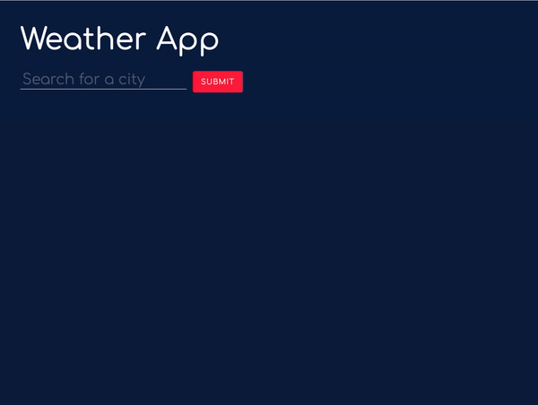
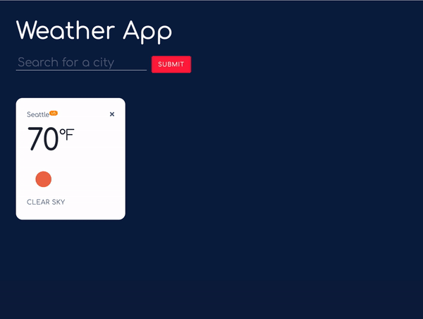
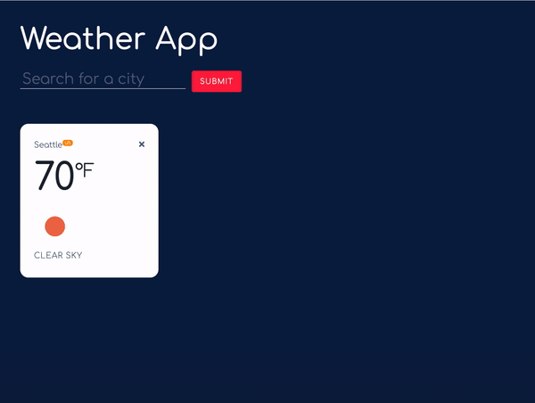
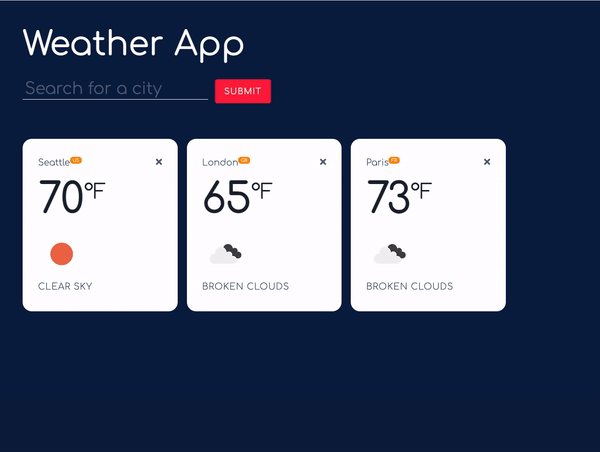

# Weather App
---
### [Visit the live site](https://tttn13.github.io/weather-app/)

Weather App is a simple yet fully functional weather application that shows the weather information of user's location or anywhere else. Users can obtain weather forecast of a specific city by entering the city name in the search bar. The app has a clean and simple UI design.   

## Technologies
- Vanilla JavaScript 
- HTML and CSS 
- OpenWeatherMap API 
- Webpack 
- localStorage for storing the data

## Key Features

##### Grab weather of the user's location 
- When the page first loaded, the user’s location and its weather data will be retrieved using geolocation.  

~~~
const loadPage = () => {
    //...
      getLocalWeather(crd.latitude, crd.longitude);
    };

    document.addEventListener("DOMContentLoaded", (event) => {
      message.innerText = "Retrieving your location...";
      navigator.geolocation.getCurrentPosition(success);
    });
  };
~~~

##### Display weather of the desired location
- As users start searching for the weather for a specific city, the entered input is going to get validated. 

- If the city name is valid, a AJAX request will be executed using Fetch API. A card containing the corresponding weather data will be shown on display.

- There will be no multiple identical list items that refer to the same city. 

~~~
async function getWeather(cityName) {
    await callAPI(
      API_data.get_city_URL(cityName),
      "Please search for a valid city 😩"
    );
  }

  async function callAPI(url, message) {
    try {
      let response = await fetch(url, { mode: "cors" });
      let cityData = await response.json();
      if (!isDuplicate(cityData.name)) {
        cities.push(cityData);
        persistToStorage();
        appLayout.setUpViews(cityData);
      }
    } catch (error) {
      const errorMessage = document.querySelector(".error");
      errorMessage.textContent = message;
    }
  }
~~~

- Users can delete unwanted weather card by clicking the delete icon.

##### 

## Future Development Plans
A new version is going to be released to extend the functionality of the app:
- Using React and Redux on the front end. 
- PostgresSQL database. 
- Build a meteogram that shows weather forecast using a charting library, namely Highcharts.js 
- Use an image API such as Flickr API to retrieve photos for each city and present them in a gallery lightbox.
